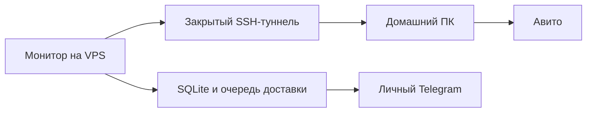

# Rent Monitor

Помогает поймать новые объявления об аренде квартиры: проверяет выбранную выдачу и присылает подходящие варианты в личный Telegram.

Сейчас ищем **двухкомнатные квартиры в Москве до 70 000 ₽ без комиссии**. Точный URL и интервалы находятся в [config/search.toml](config/search.toml).

## Как работает сейчас

Авито проверяется примерно **раз в минуту**, с разбросом ±5 секунд. Запросы выполняются на VPS, а в интернет выходят через домашнее подключение. Покупной прокси для этого режима не используется. На ПК работает скрытая задача Windows, которая поддерживает туннель и перезапускает его при разрыве.

Для нового подходящего объявления монитор открывает отдельную карточку, получает описание и характеристики и отправляет их в Telegram со ссылкой. Между карточками выдерживается 15 секунд, максимум пять за проход. Фото и видео сейчас не отправляются. Данные продавца показываются только если удалось их извлечь; отсутствующие рейтинги не придумываются.

SQLite хранит объявления, подробности, состояние источников и очередь доставки. Первый снимок становится исходной точкой наблюдения без рассылки старых квартир. Повторные проходы и рестарты не должны повторять уже доставленные объявления. Обязательные фильтры проверяются по подтверждённым данным; неизвестная комиссия не считается нулевой.

Яндекс Недвижимость включён отдельно с интервалом 300 секунд. Циан и Домклик выключены. Команды бота `/status`, `/pause`, `/resume` показывают состояние и управляют сбором.

## Где нашли решение

Пользователь предложил [mickberrad659-sketch/Avito-Parser](https://github.com/mickberrad659-sketch/Avito-Parser). Используется закреплённая версия `2d09315ead7ef1b3498415474f690eea512cf571` и наш адаптер, а не исходный массовый сбор электроники. Мы добавили квартирный поиск, домашний маршрут, постоянную сессию между выдачей и карточкой и обработку HTML PoW через cookie `pow_challenge`. [Подробности и результаты проверки](docs/home-route-status.md).

На 6 октября 2026 проверены повторные выдачи по 49 карточек, открытие трёх разных объявлений и реальная тестовая доставка в Telegram. Один переход вернул HTTP 439, после проверки PoW та же карточка открылась с HTTP 200. Новых естественных событий во время короткого теста не было, поэтому тестовая доставка была помечена отдельно. Работа без будущих блокировок не гарантируется; QRATOR и GeeTest не были проверены живым событием.

## Запуск и обслуживание

- [Постоянный домашний маршрут и VPS](deploy/home-route/README.md).
- [Текущее устройство, ограничения и проверка здоровья](docs/home-route-status.md).
- [Общие и прежние способы развёртывания](deploy/README.md).
- [Правила изменений и тесты](CONTRIBUTING.md).

ПК должен быть включён, подключён к интернету, пользователь должен войти в Windows. Задача запускается при входе и препятствует автоматическому сну. Выключение ПК прерывает сбор Авито; монитор повторяет подключение каждые 60 секунд и продолжает после восстановления. Остальные источники и очередь Telegram работают независимо.

Исторические документы в `docs/superpowers` описывают предыдущие этапы. Актуальное поведение описано выше и в документации домашнего маршрута.
